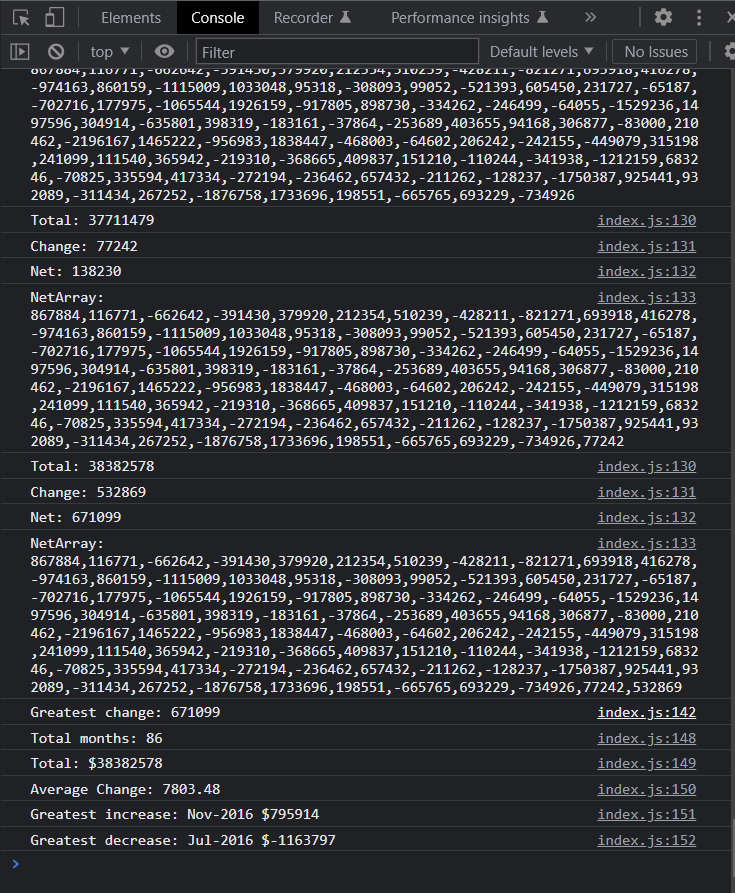

# Financial-analysis
Using javascript to analysyse finance dataset

# Module 4 challenge - console-finances

## Description

I used my learning on javascript to calculate:
-The total number of months included in the dataset.
-The net total amount of Profit/Losses over the entire period.
-The average of the changes in Profit/Losses over the entire period.
-The greatest increase in profits (date and amount) over the entire period.
-The greatest decrease in losses (date and amount) over the entire period.

# Installation

Click on following link to view website and github repository. Javascript file is in starter folder which contains coding for variables and if/for rules.

## Deployment link:
[Completed challenge] (https://mtruong1995.github.io/Console-finances/)

## Repo link:
[Repository] (https://github.com/mtruong1995/Console-finances)

## Screenshot:

## Credit

-With help from https://fantastic-pudding.vercel.app/ and Drew from edx Web development course.
